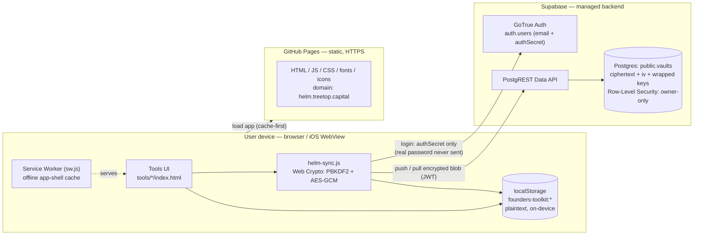
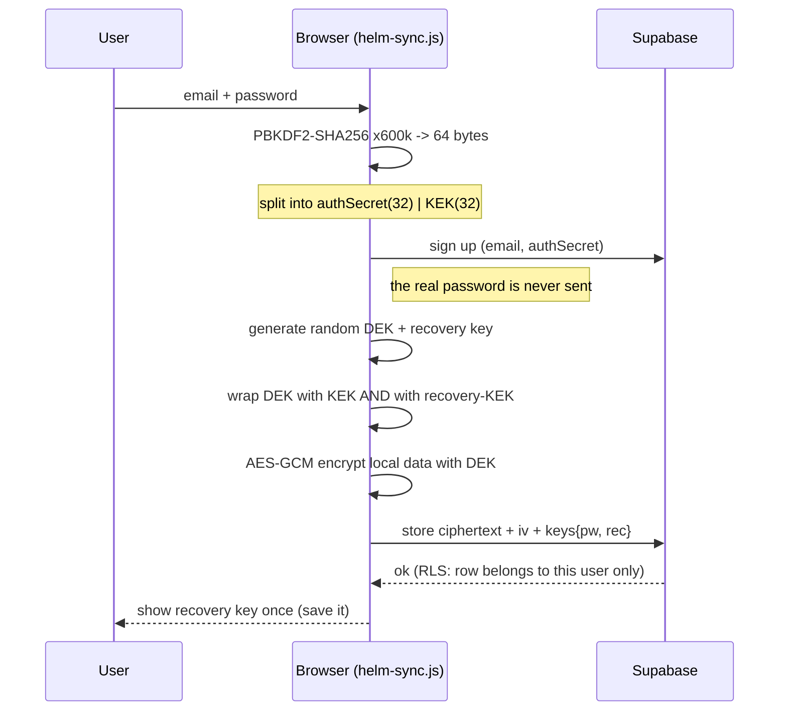

# HelpBnk — Director's Toolkit: Architecture

> Static, local-first web app. All tools work offline with no account; an optional
> account adds **end-to-end encrypted** cross-device sync via Supabase. There is no
> application server of our own and no server-side business logic.

## System architecture



**Key point:** Supabase only ever stores an opaque AES-GCM ciphertext plus a wrapped
key. The encryption key is derived on-device and never leaves it, so the server (and
we) cannot read user data.

## Sign-up & encryption flow



**Envelope encryption.** A random 256-bit Data Encryption Key (DEK) encrypts the
vault. The DEK is wrapped twice — by the password-derived KEK and by a recovery-key
-derived KEK — so **either** unlocks the data. Changing the password just re-wraps
the DEK (data and recovery key untouched). Losing **both** password and recovery key
makes the synced data unrecoverable by design.

## Sync flow

```mermaid
sequenceDiagram
  participant T as Tool page
  participant LS as localStorage
  participant Sy as helm-sync.js
  participant S as Supabase

  Note over T,LS: user edits data
  T->>LS: setItem(founders-toolkit:*)
  LS-->>Sy: write hook (debounce ~1.5s)
  Sy->>Sy: snapshot + AES-GCM encrypt (DEK)
  Sy->>S: upsert vault (JWT)
  Note over S: DB trigger sets updated_at (authoritative)
  S-->>Sy: ok
  Note over Sy: on load: pull -> last-write-wins by updated_at;<br/>local conflict backup kept if both sides moved
```

## Components

| Area | What | Where |
|------|------|-------|
| Front end | 7 self-contained tools + hub | `index.html`, `tools/*/index.html` |
| Shared JS | public config / auth+crypto+sync+UI / active-company state | `helm-config.js`, `helm-sync.js`, `helm-company.js` |
| Offline | precache app shell (bump `CACHE` per deploy) | `sw.js` |
| DB schema | `vaults` table + RLS + `delete_my_account()` | `supabase/schema.sql` |
| iOS | Capacitor wrapper of the same web app | `app/` |

## Data & secrets
- **On-device (plaintext):** all tool data in `localStorage` under `founders-toolkit:`.
- **Server-side (account only):** user **email** (readable, in `auth.users`) + an
  **unreadable encrypted blob** (`vaults`).
- **Public-by-design config:** Supabase URL + anon/publishable key live in
  `helm-config.js`; they are RLS-gated and grant nothing without a valid session.
- **Never in the repo:** `service_role` key, DB credentials, SMTP settings — these
  live only in the Supabase dashboard.

## Security posture (summary)
- PBKDF2-SHA256, 600k iterations (recovery key path: 200k). AES-GCM everywhere.
- Web Crypto requires a secure context — accounts/encryption are only active on HTTPS.
- RLS restricts every `vaults` row to its owner; `anon` has no table access.
- No analytics, trackers, third-party CDNs. Only external call is to Supabase, only
  when signed in.
- Optional extra device-only passphrase on **Company Records** (PBKDF2 250k + AES-GCM).

See [`OPS_RUNBOOK.md`](OPS_RUNBOOK.md) for deploy, restore, rotation and incident steps.
